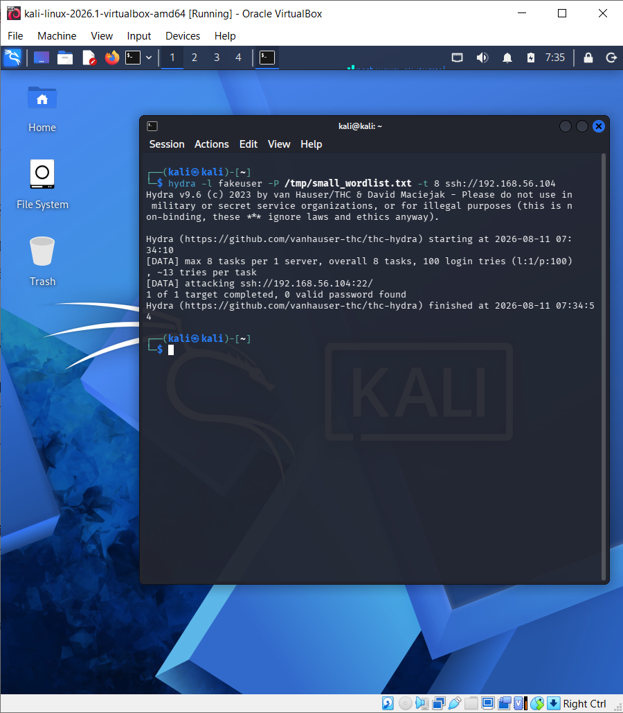
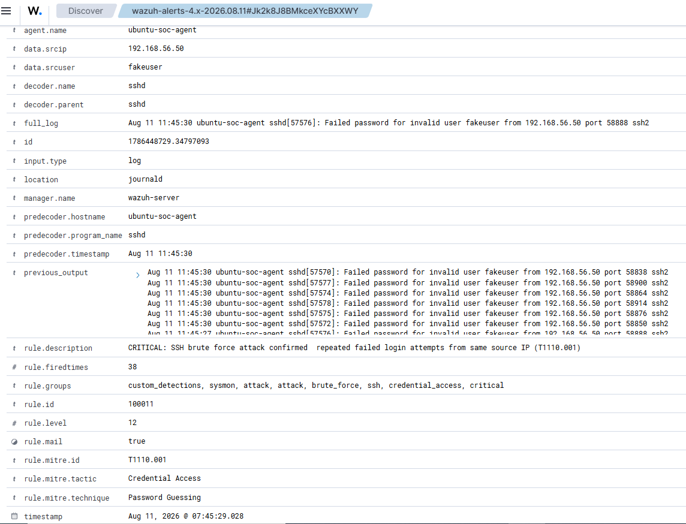
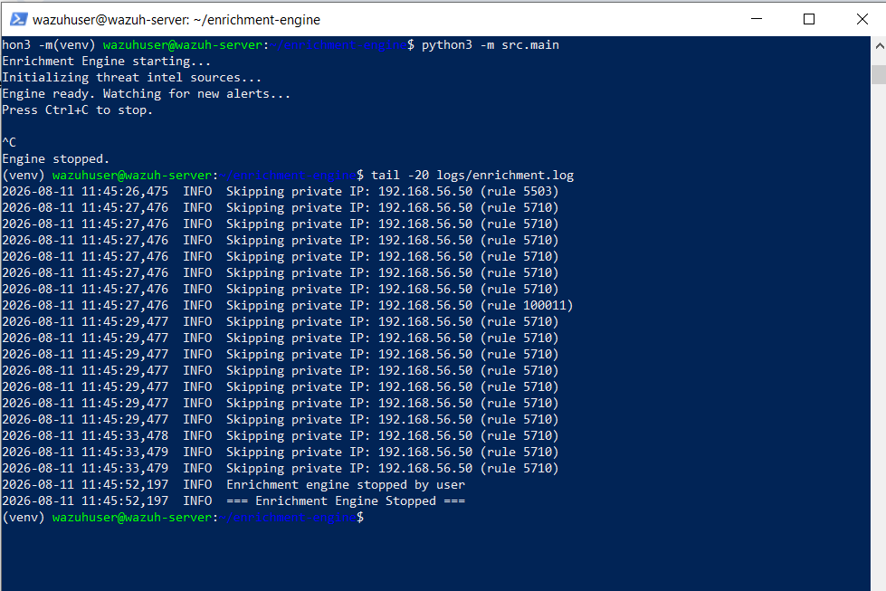

# Drill 1 — SSH Brute Force + Intel Correlation

## Alert Summary

| Field | Value |
|---|---|
| **Drill ID** | Drill-001 (Project 3) |
| **Date** | August 11, 2026 |
| **Rule Triggered** | 100011 (Level 12) — chains off built-in 5712/5710 |
| **MITRE ATT&CK** | T1110.001 — Brute Force: Password Guessing |
| **Agent** | ubuntu-soc-agent (Agent 002 — 192.168.56.104) |
| **Attack Tool** | Hydra from Kali Linux (192.168.56.50) |
| **Enrichment Outcome** | Correctly skipped — attacker IP is private (RFC1918) |
| **Verdict** | True Positive detection; enrichment filter working as designed |

---

## What This Drill Tests

Whether the enrichment engine correctly distinguishes between internal
lab traffic and external threats — specifically, that it does not
waste API calls or produce meaningless "CLEAN" verdicts by querying
public threat intelligence sources for an address that will never
have public reputation data.

---

## Attack Execution

Real Hydra brute force from Kali (`192.168.56.50`) against the Ubuntu
SOC Agent (`192.168.56.104`), using a non-existent username to trigger
Wazuh's built-in Rule 5710/5712 brute-force chain:

```bash
hydra -l fakeuser -P /tmp/small_wordlist.txt -t 8 ssh://192.168.56.104
```


**Result:** Rule 5710 fired 139 times over ~10 minutes across two
attack bursts (an initial run with a connection interruption, followed
by a clean re-run — a realistic attacker-retry pattern that was kept
in the record rather than edited out). Rule 5712 crossed its
frequency threshold (8 failures / 120s), correctly chaining into
custom Rule 100011.

---

## Wazuh Alert Evidence

```json
{
  "timestamp": "2026-08-11T06:44:37.947+0000",
  "rule": {
    "level": 12,
    "description": "CRITICAL: SSH brute force attack confirmed — repeated failed login attempts from same source IP (T1110.001)",
    "id": "100011",
    "firedtimes": 19,
    "mitre": {"id": ["T1110.001"], "tactic": ["Credential Access"], "technique": ["Password Guessing"]}
  },
  "agent": {"id": "002", "name": "ubuntu-soc-agent"},
  "previous_output": "...7 preceding failed attempts across 6 concurrent connections..."
}
```

---

## Enrichment Engine Behaviour

```
2026-08-11 06:44:34,588  INFO  Skipping private IP: 192.168.56.50 (rule 5503)
2026-08-11 06:44:34,588  INFO  Skipping private IP: 192.168.56.50 (rule 5710)
2026-08-11 06:44:34,588  INFO  Skipping private IP: 192.168.56.50 (rule 100011)
```


The engine correctly identified `192.168.56.50` as an RFC1918 private
address and skipped external enrichment for every alert generated by
this attack — including the Rule 100011 CRITICAL alert itself.

---

## Investigation Analysis

**Why this is the correct outcome, not a gap:**

1. AbuseIPDB, OTX, and MISP have zero reputation data on private IP
   space by definition — a lookup would always return a meaningless
   `CLEAN` result regardless of how malicious the actual behaviour
   was.
2. In a real network, an attacker operating from inside your own
   infrastructure (compromised internal host, insider threat, or —
   as in this lab — a red-team exercise) will always present as a
   private-range source IP to your internal monitoring. Threat intel
   enrichment is designed for identifying *external* infrastructure,
   not scoring your own network ranges.
3. Skipping the lookup avoids wasted API quota and prevents a
   dashboard full of false "CLEAN" verdicts that could give an
   analyst false confidence about genuinely malicious internal
   activity.

**What this drill demonstrates for a real deployment:** internal
lateral movement or insider-threat scenarios need a *different*
signal than public IP reputation — behavioural detection (which
Wazuh's Sysmon/auditd rules already provide) rather than threat
intel correlation. The two capabilities are complementary, not
redundant, and this drill proves the enrichment engine correctly
recognises which situation it's in.

---

## Verdict & Classification

| Field | Value |
|---|---|
| Wazuh Detection | True Positive — Rule 100011 fired correctly |
| Enrichment Decision | Correct — private IP filtered, no wasted API calls |
| Disposition | No threat-intel action required; standard IR playbook (PB-002 from Project 2) applies for containment |

---

## Simulation Context

This drill used a real, live Hydra brute-force attack against the
lab's Ubuntu SOC Agent — not synthetic alert data. The only
"simulation" element is that the attacker (Kali) is, by lab
architecture, always going to be a private IP; this is disclosed
here rather than worked around, because the resulting behaviour is
itself the intended finding of this drill.
