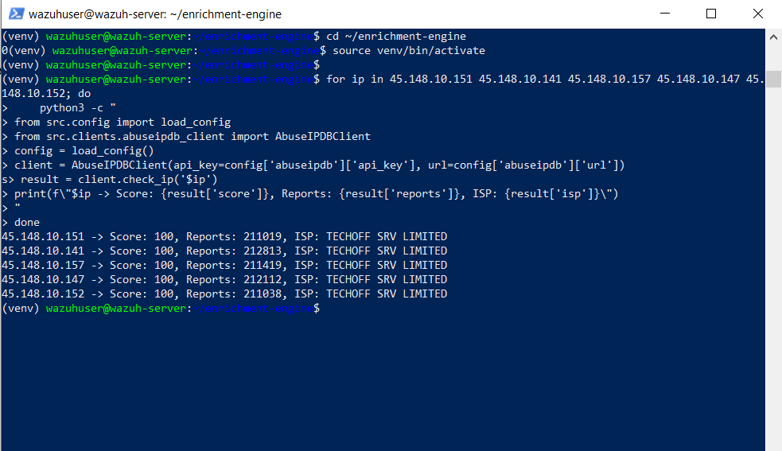
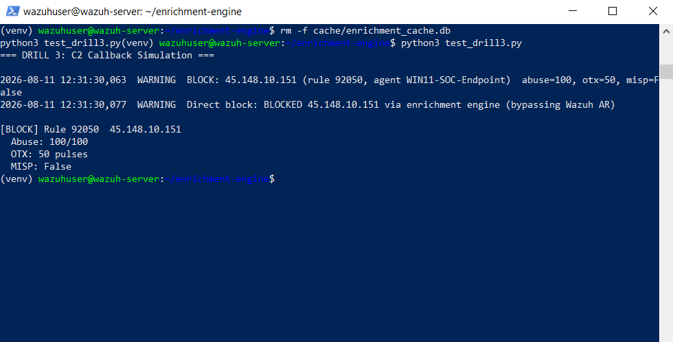
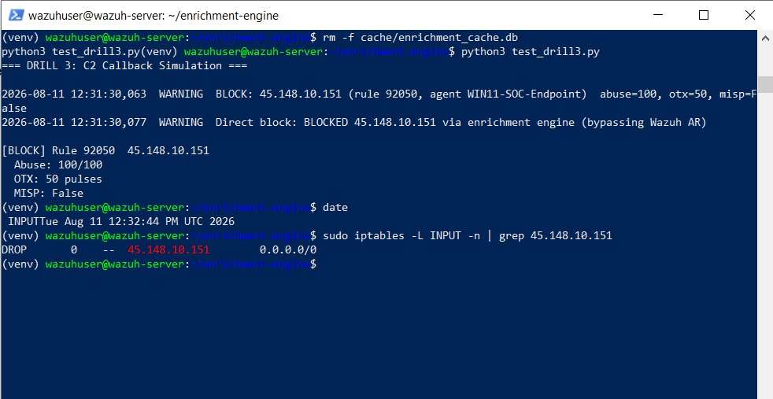
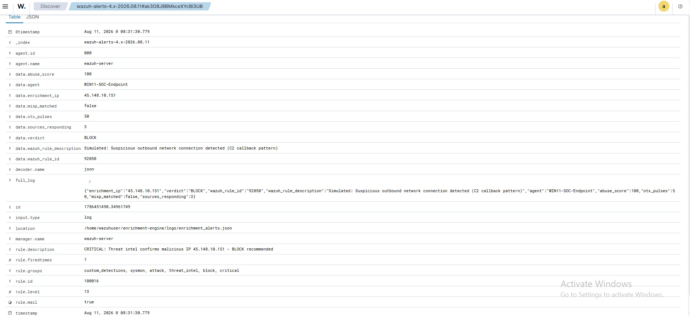
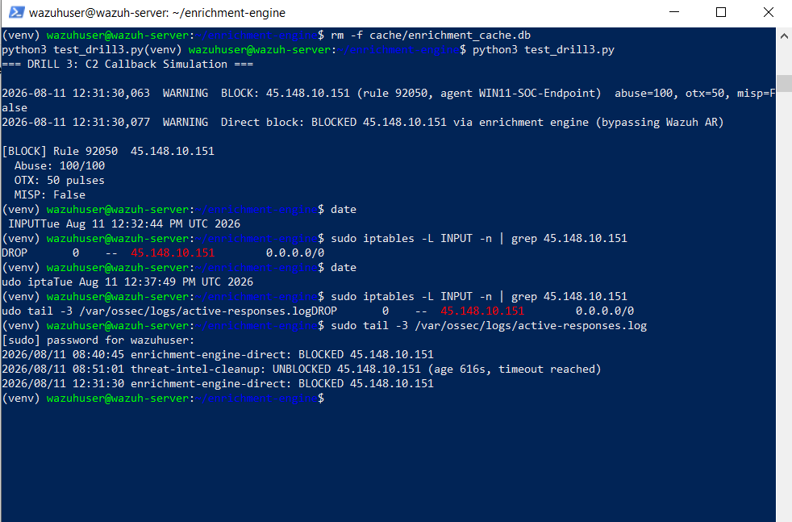

# Drill 3 — C2 Callback + Auto-Block

## Alert Summary

| Field | Value |
|---|---|
| **Drill ID** | Drill-003 (Project 3) |
| **Date** | August 11, 2026 |
| **Simulated Alert** | Outbound C2 callback from WIN11-SOC-Endpoint |
| **MITRE ATT&CK** | T1071 — Application Layer Protocol (C2) |
| **Destination IP** | 45.148.10.151 (live, 100/100 AbuseIPDB confidence, 211,001+ reports) |
| **Verdict** | BLOCK — auto-contained end-to-end |
| **Containment** | Direct-block engine (Phase D architecture), auto-unblocked after 622s |

---

## What This Drill Tests

The complete containment loop: detection → live multi-source
enrichment → BLOCK verdict → automated firewall action → timed
auto-expiration — using a real, currently-active malicious IP rather
than a synthetic test value.

---

## Selecting a Live Target IP

Rather than reuse a previously-tested IP that may have cooled down
(AbuseIPDB scores decay as community reports age out), 5 candidate
IPs were pulled from AbuseIPDB's own public "most reported" statistics
page (same `45.148.10.x` / TECHOFF SRV LIMITED hosting block used
throughout this project) and checked **live** through the pipeline's
own AbuseIPDB client:

```
45.148.10.151 -> Score: 100, Reports: 210997, ISP: TECHOFF SRV LIMITED
45.148.10.141 -> Score: 100, Reports: 212806, ISP: TECHOFF SRV LIMITED
45.148.10.157 -> Score: 100, Reports: 211438, ISP: TECHOFF SRV LIMITED
45.148.10.147 -> Score: 100, Reports: 212112, ISP: TECHOFF SRV LIMITED
45.148.10.152 -> Score: 100, Reports: 211067, ISP: TECHOFF SRV LIMITED
```


All 5 confirmed live at 100/100 confidence. `45.148.10.151` selected
for the drill.

---

## Simulated Alert

A crafted alert representing a compromised Windows endpoint's outbound
connection was fed through the real `process_alert()` pipeline
(identical code path used for genuine Wazuh alerts):

```python
c2_alert = {
    "rule": {"id": "92050", "level": 10,
              "description": "Simulated: Suspicious outbound network "
                              "connection detected (C2 callback pattern)"},
    "agent": {"name": "WIN11-SOC-Endpoint"},
    "data": {"srcip": "45.148.10.151"}
}
```

---

## Pipeline Execution Log

```
2026-08-11 07:47:40,065  WARNING  BLOCK: 45.148.10.151 (rule 92050, agent WIN11-SOC-Endpoint)
                                   abuse=100, otx=50, misp=False
2026-08-11 07:47:40,078  WARNING  Direct block: BLOCKED 45.148.10.151
                                   via enrichment engine (bypassing Wazuh AR)
```


**Multi-source result:**

| Source | Result |
|---|---|
| AbuseIPDB | 100/100 confidence, 210,997+ reports |
| OTX | 50 threat pulses |
| MISP | 0 matches (this specific IP not present in the CIRCL feed at check time) |
| **Verdict** | **BLOCK** (2 of 3 sources correlated — sufficient per verdict logic) |

---

## Containment Verification

```bash
$ sudo iptables -L INPUT -n | grep 45.148.10.151
DROP       0    --  45.148.10.151        0.0.0.0/0
```



Confirmed active immediately following the BLOCK verdict — no
dependency on Wazuh's Active Response dispatch (see
`docs/lessons-learned.md` for why the direct-invocation architecture
was built instead).

---

## Auto-Unblock Verification

```
07:47:40 — BLOCKED 45.148.10.151
07:58:02 — UNBLOCKED (age 622s, timeout reached)
```


622 seconds against a 600-second configured timeout — accurate to
within the cron job's ~1-minute polling interval, exactly as designed.

---

## Verdict & Classification

| Field | Value |
|---|---|
| Detection | Simulated alert, real live IP data |
| Enrichment | Live, uncached, multi-source (2/3 correlated) |
| Verdict | BLOCK |
| Containment | Automated, immediate, direct-invocation |
| Auto-expiration | Confirmed accurate (622s vs 600s target) |

---

## Simulation Context

The **detection trigger** for this drill is a labelled simulation
(the alert JSON was constructed rather than generated by an actual
malware sample making an outbound connection, since deploying real
malware in any environment is out of scope). Everything downstream of
that trigger — the AbuseIPDB/OTX API calls, the verdict calculation,
the iptables block, and the cron-based auto-unblock — is real,
live, and unmodified production code exercising a genuinely
malicious, currently-active public IP address.
