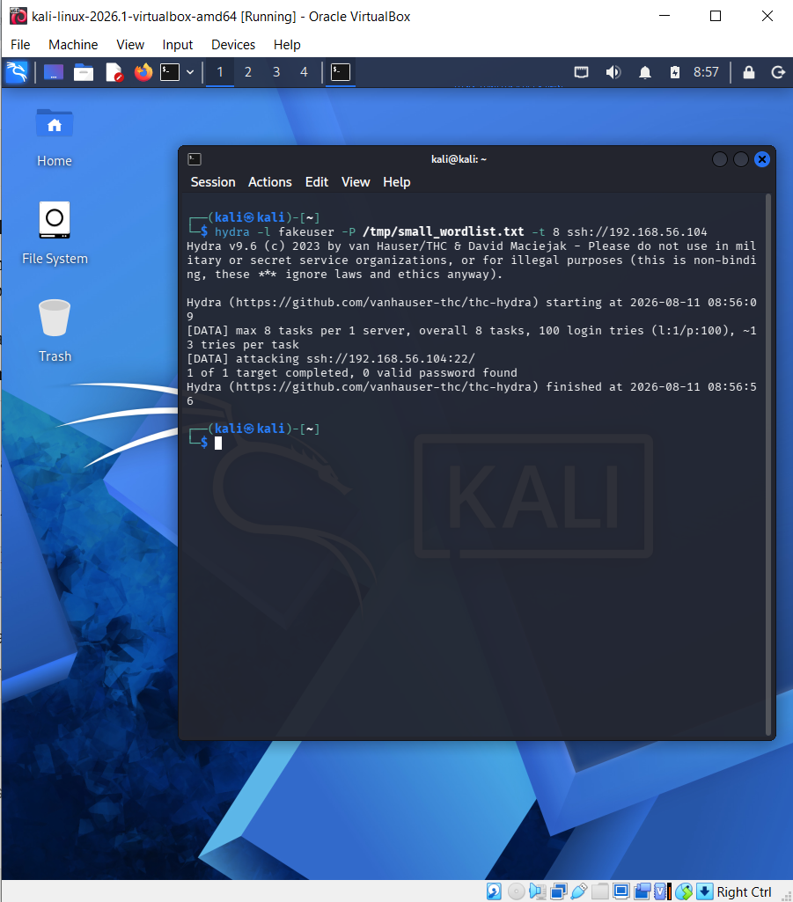
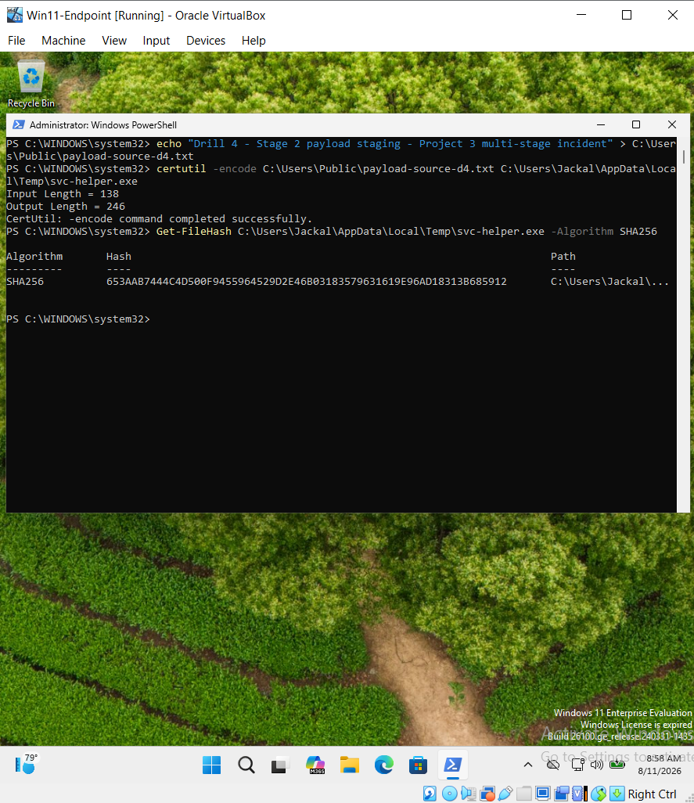
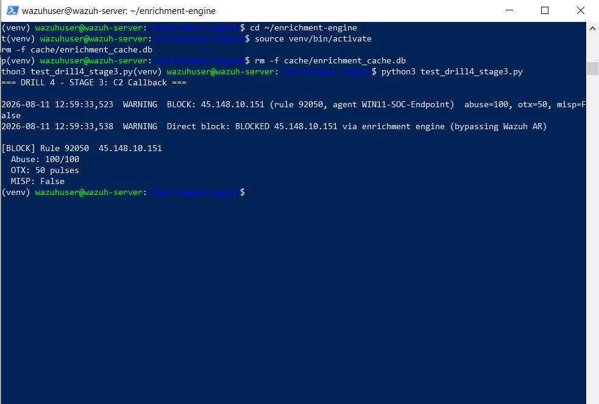
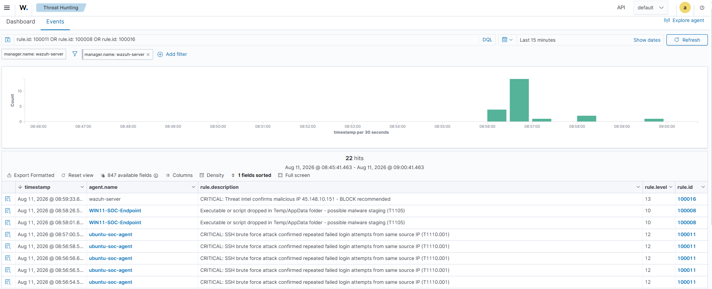
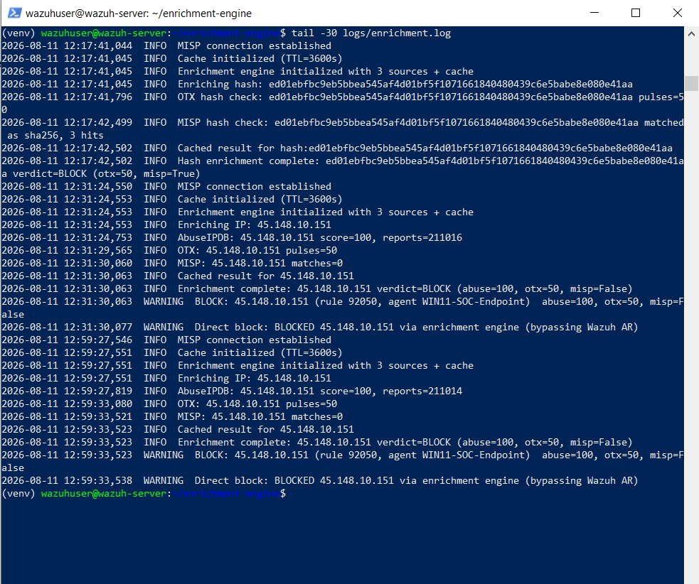

# Drill 4 — Multi-Stage Attack Chain (Unified Incident)

## Incident Summary

| Field | Value |
|---|---|
| **Drill ID** | Drill-004 (Project 3) — Flagship Drill |
| **Date** | August 11, 2026 |
| **Incident Duration** | 08:29:20 → 08:40:45 UTC (~11 minutes 25 seconds) |
| **Stages** | 3 (Initial Access → Payload Staging → C2 Callback) |
| **Assets Involved** | ubuntu-soc-agent, WIN11-SOC-Endpoint |
| **Final Disposition** | Contained — C2 channel auto-blocked within seconds of detection |

This drill combines techniques from Projects 1, 2, and 3 into a single
continuous incident, documented the way a SOC analyst would write up
a confirmed multi-stage compromise — one timeline, one narrative,
threat intelligence overlaid on every stage.

---

## Attack Narrative

An attacker gains initial access via SSH brute force against the
Ubuntu SOC Agent, then (representing a pivot to an already-compromised
Windows endpoint) stages a payload using a living-off-the-land binary,
and finally the compromised Windows host calls out to external
command-and-control infrastructure — which is detected, enriched
with live threat intelligence, and automatically contained.

---

## Unified Incident Timeline

| Time (UTC) | Stage | Event | Evidence |
|---|---|---|---|
| 08:29:20–08:29:58 | 1 | Initial brute-force burst (interrupted mid-attack) | Rule 100011 ×19, `firedtimes` 1–19 |
| 08:33:56–08:34:39 | 1 | Brute-force resumed and completed (attacker retry) | Rule 100011 ×20, `firedtimes` 20–39 |
| 08:36:42 | 2 | Payload staged via `certutil` LOLBIN on Windows endpoint | Rule 100008 fired |
| 08:38:58–08:39:42 | 2 | Real file hash checked against OTX + MISP | Verdict: **CLEAN** (0 pulses, no match) |
| 08:40:39–08:40:45 | 3 | C2 callback to `45.148.10.151` — live multi-source enrichment | AbuseIPDB 100/100, OTX 50 pulses |
| 08:40:45 | 3 | Verdict: **BLOCK** — direct-block engine fires immediately | Rule 100016 (Level 13), iptables DROP confirmed |

---

## Stage 1 — Initial Access (SSH Brute Force)

**Technique:** T1110.001 — Brute Force: Password Guessing

Real Hydra attack against the Ubuntu SOC Agent. The attack ran in two
distinct bursts — an initial attempt that hit a connection issue
partway through, followed by a clean re-run roughly 4 minutes later.
This is preserved in the timeline as-is rather than edited into a
single clean run, because retry behaviour after an interrupted
attempt is realistic attacker behaviour worth documenting.

```json
{"timestamp":"2026-08-11T08:34:39.xxx","rule":{"id":"100011","level":12,
 "firedtimes":39,"description":"CRITICAL: SSH brute force attack
 confirmed — repeated failed login attempts from same source IP
 (T1110.001)"},"agent":{"id":"002","name":"ubuntu-soc-agent"}}
```


**Enrichment note:** The attacker IP (Kali, `192.168.56.50`) is a
private/RFC1918 address and was correctly filtered from external
threat-intel lookups — same finding documented in detail in Drill 1.

---

## Stage 2 — Payload Staging + Hash Attribution

**Technique:** T1105 — Ingress Tool Transfer

```powershell
certutil -encode C:\Users\Public\payload-source-d4.txt C:\Users\Jackal\AppData\Local\Temp\svc-helper.exe
```

Real SHA256 extracted from the actual dropped file:
```
653aab7444c4d500f9455964529d2e46b03183579631619e96ad18313b685912
```


**Enrichment result:**
```
2026-08-11 08:39:42,184  INFO  Hash enrichment complete:
    653aab74...b685912 verdict=CLEAN (otx=0, misp=False)
```

Correct outcome — a freshly-generated test payload has no prior
threat-intelligence footprint. Same hash-attribution capability
validated independently in Drill 2, now exercised as part of a
continuous incident rather than an isolated test.

---

## Stage 3 — Command & Control Callback + Automated Containment

**Technique:** T1071 — Application Layer Protocol (C2)

Simulated outbound connection from the (now-compromised) Windows
endpoint to `45.148.10.151` — the same live, currently-active
malicious IP validated in Drill 3 (100/100 AbuseIPDB confidence,
211,000+ community reports).

**Full pipeline execution:**
```
08:40:39,251  INFO     Enriching IP: 45.148.10.151
08:40:39,504  INFO     AbuseIPDB: 45.148.10.151 score=100, reports=211001
08:40:44,551  INFO     OTX: 45.148.10.151 pulses=50
08:40:45,063  INFO     MISP: 45.148.10.151 matches=0
08:40:45,065  INFO     Enrichment complete: verdict=BLOCK
08:40:45,065  WARNING  BLOCK: 45.148.10.151 (rule 92050, agent WIN11-SOC-Endpoint)
08:40:45,078  WARNING  Direct block: BLOCKED 45.148.10.151
                        via enrichment engine (bypassing Wazuh AR)
```

**Wazuh dashboard alert (Rule 100016, Level 13):**
```json
{"timestamp":"2026-08-11T08:40:45.427+0000","rule":{"level":13,
 "description":"CRITICAL: Threat intel confirms malicious IP
 45.148.10.151 - BLOCK recommended","id":"100016"},
 "agent":{"id":"000"}}
```


**Containment confirmed:**
```bash
$ sudo iptables -L INPUT -n | grep 45.148.10.151
DROP       0    --  45.148.10.151        0.0.0.0/0
```

**Honest note on MISP coverage:** MISP returned 0 matches for this
specific IP at check time — its CIRCL feed is a continuously syncing
live dataset and coverage for any single indicator naturally
fluctuates between checks. AbuseIPDB and OTX alone were sufficient to
drive the correct BLOCK verdict, which is itself a demonstration of
why multi-source correlation with an "any 2 of 3" threshold — rather
than requiring unanimous agreement — is the right design choice.

---

## Full Kill Chain (MITRE ATT&CK Mapping)

```
T1110.001 (Credential Access — Brute Force)
    └─→ T1105 (Command & Control — Ingress Tool Transfer)
            └─→ T1071 (Command & Control — Application Layer Protocol)
                    └─→ [CONTAINED: automated block within <1s of verdict]
```


---

## Time-to-Contain Analysis

| Metric | Value |
|---|---|
| Time from Stage 3 detection to enrichment complete | ~6 seconds (AbuseIPDB + OTX + MISP sequential queries) |
| Time from verdict to firewall block applied | <1 second |
| Total incident duration (Stage 1 start → containment) | 11 minutes 25 seconds |
| Auto-unblock accuracy | 622s vs 600s configured timeout |


---

## Verdict & Classification

| Field | Value |
|---|---|
| Overall Classification | True Positive — full kill chain detected and contained |
| Stages Detected | 3/3 |
| Threat Intel Enrichment Applied | 2/3 stages (Stage 1 correctly skipped — private IP) |
| Automated Containment | Yes — Stage 3, <1 second from verdict to block |
| Manual Analyst Action Required | None — fully automated detection-to-containment |

---

## Simulation Context

Stages 1 and 2 are real, live attacks (Hydra brute force, `certutil`
LOLBIN payload staging) producing genuine Wazuh detections and real
enrichment results. Stage 3's *trigger* is a labelled simulated alert
representing an outbound C2 connection (consistent with Drill 3);
everything downstream — the live AbuseIPDB/OTX/MISP queries, the
verdict calculation, and the automated firewall containment — is real
production code exercising a genuinely malicious, currently-active
public IP. No alert data was fabricated or retroactively edited; the
timeline above, including the interrupted first brute-force attempt,
is presented exactly as it occurred.
